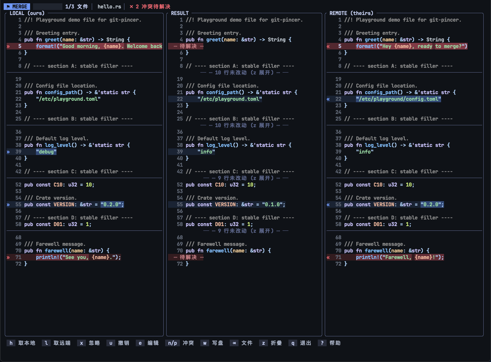

<p align="center">
  
</p>

# git-pincer

[](https://github.com/zlx2019/git-pincer/actions/workflows/ci.yml)
[](https://crates.io/crates/git-pincer)
[](./LICENSE)
[](https://www.rust-lang.org)

[English](./README.md) | **简体中文**

> **「蟹钳」**，一个使用 Rust 编写的 Git 终端工具，专注于帮助开发者更轻松地解决 Git Merge、Rebase、Cherry-pick 等场景下的代码冲突。

项目名称来源于 Rust 的吉祥物——螃蟹。Git 冲突就像两个分支同时「夹住」了同一段代码，而蟹钳象征着稳定、精准与掌控。希望它能够像一只可靠的蟹钳，帮助开发者牢牢抓住冲突双方，更高效地理解差异、完成合并。



## 特性

- **三栏合并界面** — 本地 | 结果 | 远端,块级色带按改动类型着色,沿用 IDEA 语义:蓝 = 修改、绿 = 新增、灰 = 删除、红 = 冲突;块解决后色带随之消失。
- **精细的差异呈现** — 改动块内 delta 式词级高亮,配合语法着色(syntect 的 Maple 主题,按扩展名匹配,超大文件自动降级)。
- **接管完整流程** — 全部文件解决后自动执行 `git add` 与对应的 `--continue`,重新探测并循环,直到仓库干净;多提交摘取、多轮变基开箱即用。
- **RPG 像素风操作菜单** — 在干净仓库中裸运行 `git-pincer` 弹出像素风菜单,状态窗把仓库映射成角色面板(Lv. = 提交数、HP = 未提交改动、MP = 贮藏、EXP = 待推送);选操作,再选分支(merge / rebase)或提交(cherry-pick / revert),成功与失败都在 TUI 内弹框反馈并回到菜单——不闪屏、不退出。
- **广泛的冲突来源支持** — merge、rebase、pull、cherry-pick、revert、`git am`,以及 `stash pop`、`checkout -m`、`apply --3way` 这类没有 `--continue` 的场景。
- **原生 git,无黑魔法** — 全部 shell out 调用你的 git 二进制(与 lazygit / IDEA 同路),认证、hooks、合并策略、rerere 完全继承现有配置;参数以数组传递不经过 shell(构造上杜绝注入),并清除宿主 `GIT_DIR` 类环境变量,防止从钩子中被调起时嵌套 git 劫持到错误仓库。
- **终端自适应主题** — 深色(Tokyo Night)/ 浅色(Maple Light)双主题,`--theme <auto|dark|light>` 指定,`auto` 经 `COLORFGBG` 检测;不支持真彩的终端自动量化为 xterm-256 色。
- **中英双语界面** — 菜单、提示与输出全部提供中英文,`--lang <auto|zh|en>` 指定,`auto` 跟随系统 locale;文案维护在 `locales/*.conf`,编译期嵌入——依然是单个二进制。
- **周全的兜底** — 二进制冲突降级为整文件二选一;免 git 的 `file` 模式直接解析冲突标记;非 TTY 环境给出可读报错而非 panic。

## 安装

需要 `PATH` 中有 `git`。

```bash
cargo install git-pincer
```

主流平台的预编译二进制也会附在 [GitHub Releases](https://github.com/zlx2019/git-pincer/releases);源码构建(Rust 1.96+):

```bash
cargo install --git https://github.com/zlx2019/git-pincer
```

## 用法

```bash
git-pincer                      # 有冲突现场:直接接管解决
                                # 仓库干净:弹出交互式操作菜单
git-pincer merge <branch>       # 执行 git merge,撞冲突则接管
git-pincer rebase <branch>      # 执行 git rebase,多轮冲突自动循环
git-pincer pull origin main     # 参数原样透传给 git pull
git-pincer cherry-pick <commit> # 多提交 / 选项均可透传
git-pincer revert <commit>      # 执行 git revert 并接管冲突
git-pincer file conflict.txt    # 免 git:解析带冲突标记的文件,解决后写回
git-pincer abort                # 中止进行中的合并操作(有确认)
git-pincer completions zsh      # 生成 shell 补全脚本(bash/zsh/fish/powershell/elvish)
```

全局选项:

| 选项 | 说明 |
| ---- | ---- |
| `-C, --repo <PATH>` | 操作指定路径的仓库(默认当前目录) |
| `--theme <auto\|dark\|light>` | 界面主题;`auto` 读取 `COLORFGBG`,检测不到用深色 |
| `--lang <auto\|zh\|en>` | 界面语言;`auto` 跟随系统 locale(中文环境用中文,其余英文) |
| `-v, --verbose` | 回显执行的每条 git 命令 |

### 配置文件

可选配置文件位于 `~/.config/git-pincer/config.toml`(遵循 `$XDG_CONFIG_HOME`;Windows 为 `%APPDATA%\git-pincer\config.toml`;环境变量 `GIT_PINCER_CONFIG` 可完全覆盖路径)。命令行参数的优先级始终高于配置文件;文件不存在即用默认值,内容非法则启动时给出可读错误。

```toml
[ui]                    # 上表全局选项的默认值
theme = "auto"          # auto | dark | light
lang = "auto"           # auto | zh | en
verbose = false
editor = "nvim"          # e 键使用的编辑器;缺省回退 $VISUAL > $EDITOR > vim > vi(Windows 为 notepad)

[keys]                  # 重绑按键 —— 替换该动作的全部默认键位
take-local = "o"
write = "ctrl+s"        # 修饰键:ctrl+ / alt+ / shift+;命名键:left、up、tab、enter、space、f1-f12 等

[theme.dark]            # 按颜色名覆盖任意颜色([theme.light] 同理)
rpg_accent = "#ff7a2f"
band_conflict = ["#3a1e22", "#5e2d35"]   # band_* / emph_* 类颜色为 [普通, 选中] 双色对
```

可重绑的动作:`take-local`、`take-remote`、`ignore`、`undo`、`undo-file`、`edit`、`apply-all`、`next-change`、`prev-change`、`next-conflict`、`prev-conflict`、`copy-chunk`、`copy-file`、`copy-local`、`copy-remote`、`write`、`next-file`、`fold`、`quit`、`help`。覆盖后的按键会自动同步显示在提示条与帮助浮层中;未知动作名、键位冲突与非法颜色都会在启动时报错并列出全部合法值。

不需要 git 仓库也能试玩 TUI:

```bash
cp fixtures/conflict.txt /tmp/ && git-pincer file /tmp/conflict.txt
```

### 按键

| 按键 | 动作 |
| ---- | ---- |
| `h` / `←` | 取用本地侧(冲突两侧先后取用 = 两者都要) |
| `l` / `→` | 取用远端侧 |
| `x` | 忽略当前块剩余未处理的侧(保留 base) |
| `u` | 撤销当前块的全部决定 |
| `U` | 撤销当前文件的全部决定 |
| `e` | 用 `$EDITOR` 编辑当前块 |
| `a` | 一键应用所有非冲突改动 |
| `j` / `k` | 移动到下一个 / 上一个改动块 |
| `n` / `p` | 跳到下一个 / 上一个未解决冲突 |
| `Ctrl+d` / `Ctrl+u` | 视口下/上滚半页(导航键会重新吸附回光标块) |
| `y` / `Y` | 复制当前块结果 / 整个文件结果 |
| `H` / `L` | 复制当前块的本地侧 / 远端侧 |
| `w` | 写盘(自动应用剩余非冲突改动,随后 `git add`) |
| `Tab` | 切换到下一个文件 |
| `z` | 折叠 / 展开未改动区域 |
| `q` | 退出(未完成时需按两次;现场保留) |
| `?` | 查看完整按键说明 |

### 支持的冲突来源

| 来源 | 探测依据 | 收尾方式 |
| ---- | -------- | -------- |
| `git merge` / `git pull` | `MERGE_HEAD` | `git merge --continue` |
| `git rebase` | `rebase-merge` / `rebase-apply` | `git rebase --continue`(多轮) |
| `git cherry-pick` | `CHERRY_PICK_HEAD` | `git cherry-pick --continue`(多轮) |
| `git revert` | `REVERT_HEAD` | `git revert --continue` |
| `git am -3` | `rebase-apply/applying` | `git am --continue` |
| `stash pop` / `checkout -m` / `apply --3way` | 仅 index 中的 unmerged 条目 | 无需 continue,解完即可 |

## 工作原理

- **diff3 内核** — 两次 2-way diff(base→ours、base→theirs,Myers 算法,500 ms 超时保护),按 base 行区间碰撞归组为块:稳定、单侧、双方一致或冲突。归组策略刻意保守:宁可多报一个冲突,也不静默合错。
- **纯逻辑会话** — 每个块的每一侧处于待处理 / 已取用 / 已忽略三态;取用顺序决定内容拼接方式,`$EDITOR` 编辑整块覆写;含 NUL 字节的文件降级为整文件二选一。
- **git 薄封装** — 冲突内容读自 index 的 stage 1/2/3,写回经 `git add`;仓库状态(merge / rebase / cherry-pick / revert / am)从 git 目录探测,保证收尾命令永远正确。

## 开发

```bash
cargo nextest run --all-features --no-tests pass   # 测试
cargo clippy --all-targets --all-features -- -D warnings
cargo fmt --all -- --check
```

工具链准备、pre-commit 钩子与提交规范见 [CONTRIBUTING.md](./CONTRIBUTING.md)。

## 致谢

基于 [ratatui](https://github.com/ratatui/ratatui)、[similar](https://github.com/mitsuhiko/similar)、[syntect](https://github.com/trishume/syntect) 与 [clap](https://github.com/clap-rs/clap) 构建;视觉设计受 IntelliJ IDEA 合并工具、[delta](https://github.com/dandavison/delta) 与 [lazygit](https://github.com/jesseduffield/lazygit) 启发。

## License

本项目采用 [MIT](./LICENSE) 许可证分发。
